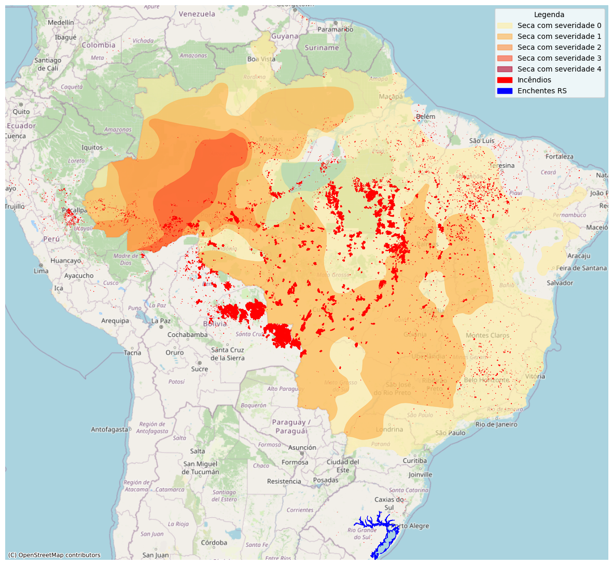

# Finder

**Finder** é uma ferramenta de código aberto desenvolvida para identificar pessoas e áreas afetadas por desastres climáticos no Brasil. Este repositório organiza scripts e modelos que trabalham com dados climáticos e transacionais para realizar análises geoespaciais avançadas e gestão de crises.

## Estrutura do Repositório

- **`Enchentes/`**: Scripts e dados relacionados à coleta e análise de eventos de enchentes.
- **`Incêndios/`**: Scripts e dados para trabalhar com eventos de incêndios.
- **`Secas/`**: Informações e ferramentas para tratar eventos de seca.
- **`union_polig/`**: Realiza a união de todos os tipos de polígonos de catástrofes climáticas (enchentes, incêndios e secas), criando uma estrutura consolidada para análise.
- **`Clustering model/`**: Contém o modelo de clustering que define a principal localização dos usuários. Baseia-se em eventos transacionais para identificar o principal cluster associado a cada usuário.
- **`Find_users_and_affected_areas/`**: Scripts para realizar o `join` entre os polígonos de áreas afetadas e as localizações dos usuários, além de identificar quem foi afetado e a área impactada dos usuários.

## Funcionalidades

1. **Coleta de Dados**: Organização e análise de informações climáticas relevantes.
2. **União de Polígonos**: Integração de dados espaciais para gerar uma visão consolidada de áreas de risco.
3. **Clusterização**: Identificação de padrões de localização e comportamento dos usuários.
4. **Impacto Direto**: Identificação de usuários e áreas diretamente afetadas por desastres.

## Contribuições

O projeto ainda não está finalizado e estamos aceitando ajuda! Se você tem interesse em apoiar, entre em contato pelo LinkedIn: [Gunnar Guilherme](https://www.linkedin.com/in/gunnar-guilherme).

